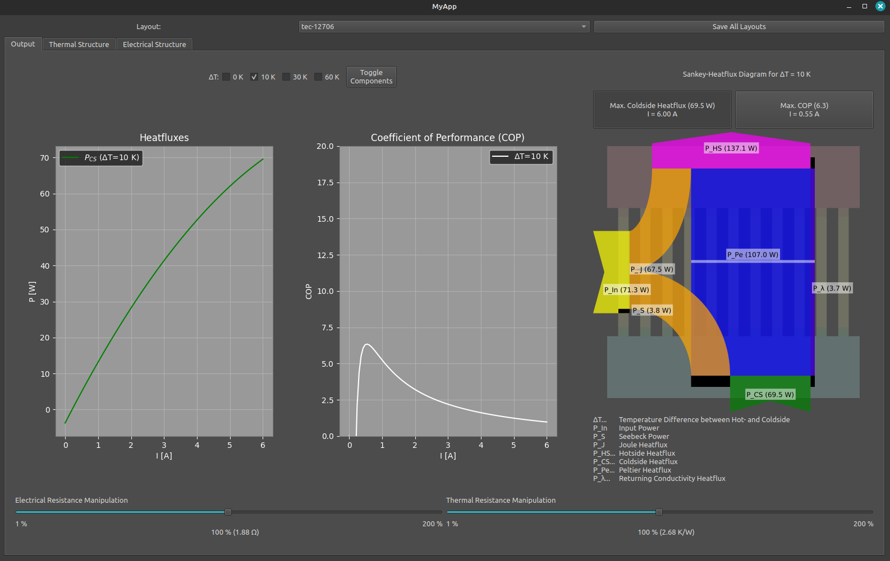

# Masterprojekt of Leonhard Gehlauf at HTWK Leipzig

This is a simple program to build thermoelectric coolers layer by layer and visualize the heat fluxes.

To build and compile it, download the repository, unzip it and do the following steps:

### 1.:  
python3 -m venv venv

### 2. on Linux/ macOS:  
source venv/bin/activate  
### 2. on windows:  
\venv\Scripts\Activate.ps1

### 3.:  
pip install -r requirements.txt

### 4.:  
python main.py
