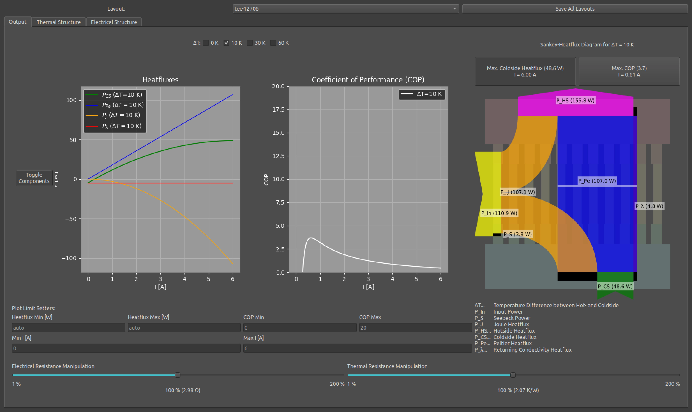

# Masterprojekt of Leonhard Gehlauf at HTWK Leipzig

This is a simple program to build thermoelectric coolers layer by layer and visualize the heat fluxes.



To build and compile it, download the repository, unzip it and do the following steps:

#### 1. Build Virtual Environment

**Linux / macOS:**

```bash
python3 -m venv venv
```

**Windows (PowerShell):**

```powershell
py -m venv venv
```

---

#### 2. Activate Virtual Environment

**Linux / macOS:**

```bash
source venv/bin/activate
```

**Windows (PowerShell):**

```powershell
Set-ExecutionPolicy -Scope Process -ExecutionPolicy Bypass
.\venv\Scripts\Activate.ps1
```

---

#### 3. Install required Libraries

```bash
pip install -r requirements.txt
```

---

#### 4. Start Application

**Linux / macOS:**

```bash
python3 main.py
```

**Windows (PowerShell):**

```powershell
py main.py
```
